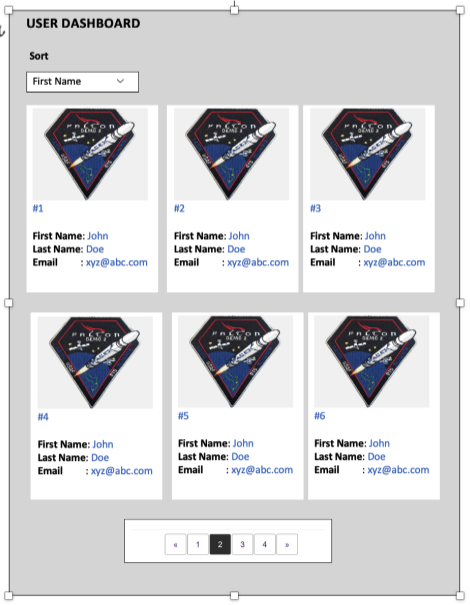

# React test

## How to run the project

### Prerequisites

- npm

### Steps

- Open terminal Go to project directory.
- Install all dependancies using command `npm install`
- Run project using command `npm start`
- Done

```
git clone git@github.com:mayurkathale/react-user-test.git user-test
cd user-test
npm install
npm run dev
```

### Screens

Prototype:

Implemented:


### Approach

- Initialised project boilerplate using _Create react app_.
- Installed and configured libraries like eslint, preetier, jest, husky in order to maintain code quality following coding standards.
- Wrote husky pre-commit script which does type checking, checks code format, runs unit tests before committing code to git.
- Created components according to requirements with Sass module to provide css.
- Created React state stores using Redux.
- Added <Loading /> component which gets loaded dynamically using _next/dynamic_.
- Used Grid css layout as looks best for the given UI prototype. Responsive UI achieved using sass mixins.
